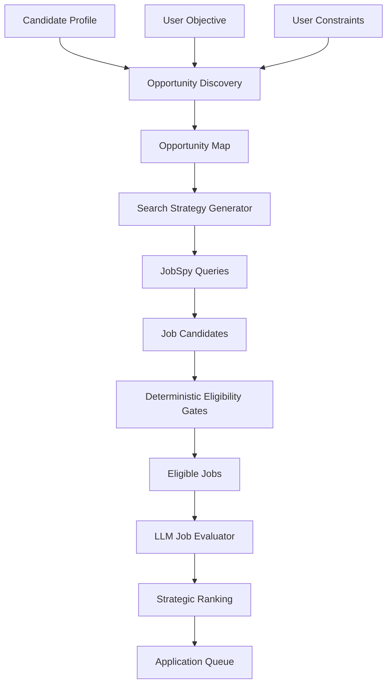

# Career OS — Dynamic Opportunity Architecture

## 1. Architectural Diagnosis

The current Career OS prototype (Scoring v2) suffers from a fundamental architectural inversion: it requires the user to pre-specify target domains before discovery can begin. This creates a closed loop where the system can only find what the user already knows to look for.

**Root Problems in Current Architecture:**

| Problem | Current Implementation | Impact |
|---------|----------------------|--------|
| Domain hardcoding | `PRIMARY_DOMAINS = ["payments", "kyc/aml/...", "data/analytics", "product"]` | Cannot discover careers outside predefined list |
| Domain inference | Keyword-based `infer_domain()` with 30+ hardcoded rules | Brittle; misses novel career paths |
| Scoring weights | Fixed 30/25/20/15/10 | Cannot adapt to user objective |
| User constraints | Silently overridden by LLM (e.g., `willing_to_relocate_us=True`) | Violates user sovereignty |
| Domain = Opportunity | Current experience domain = future opportunity domain | Misses strategic pivots |

**The Core Insight:** A candidate's *current experience domain* is not their *opportunity domain*. The system must separate:
- **Current experience** (what they've done) → evidence
- **Capabilities** (what they can do) → transferable
- **Opportunity space** (where those capabilities create value) → discovered dynamically
- **Specific job** (what's available now) → filtered from discovery

**Evidence from Prototype:** The Scoring v2 run on 196 Tier 1 jobs produced 1 A / 73 B / 7 C / 115 D. The single A was a "Product Analyst (Hybrid NYC/Remote)" — a role already in the user's explicit target list. The system never discovered adjacent high-upside paths like Trading Technology PM, AI Product, or Enterprise Platform PM because those domains weren't in the hardcoded `PRIMARY_DOMAINS` list.

**Required Shift:** Move from **domain-targeted search** to **capability-driven opportunity discovery**.

---

## 2. New Career OS Pipeline



### Pipeline Stages

| Stage | Input | Output | Responsibility |
|-------|-------|--------|----------------|
| **Candidate Profile** | CV, user input | Structured facts + capabilities | LLM extraction |
| **User Objective** | User input | Structured objective | User provides |
| **User Constraints** | User input | Deterministic gates | User provides |
| **Opportunity Discovery** | Profile + Objective | Opportunity Map (JSON) | **LLM** |
| **Search Strategy** | Opportunity Map | JobSpy queries | **LLM** |
| **Job Retrieval** | Queries | Raw job candidates | JobSpy (deterministic) |
| **Eligibility Gates** | Raw jobs + constraints | Eligible jobs | Deterministic |
| **Job Evaluation** | Eligible jobs + profile | Structured assessments | **LLM** |
| **Strategic Ranking** | Evaluations + objective | Ranked list | **LLM** |
| **Application Queue** | Ranked jobs | Actionable cards | Deterministic + LLM |

### Key Architectural Boundaries

| Boundary | Deterministic | LLM-Driven |
|----------|---------------|------------|
| **Eligibility** | ✅ Hard gates (employment type, recency, location auth, product function) | ❌ |
| **Opportunity discovery** | ❌ | ✅ Full LLM reasoning |
| **Search query generation** | ❌ | ✅ LLM generates JobSpy queries |
| **Job interpretation** | ❌ | ✅ LLM reads JD, extracts structure |
| **Fit assessment** | ❌ | ✅ LLM evaluates transferability, transition, upside |
| **Strategic ranking** | ❌ | ✅ Objective-weighted LLM ranking |
| **Application Queue** | ✅ Card creation, status lifecycle | ✅ Answer generation, evidence |

---

## 3. Candidate Model

The Candidate Model separates **facts**, **capabilities**, and **evidence** — never conflating them.

### 3.1 Candidate Facts (Extracted, Verifiable)

```json
{
  "facts": {
    "current_role": "Associate — Digital Product Management",
    "current_company": "American Express",
    "location": "Gurugram, India",
    "total_experience_years": 5,
    "experience": [
      {
        "role": "Associate — Digital Product Management",
        "company": "American Express",
        "duration": "Jan 2023 – Present",
        "platform": "PEGA/ACE (CLIC/CMT)",
        "scale": "250K–300K monthly cases"
      },
      {
        "role": "Analyst — Customer Experience & Process Analytics",
        "company": "Amazon",
        "duration": "Aug 2020 – Dec 2022",
        "scope": "500K+ customer interactions"
      },
      {
        "role": "Sales Analyst",
        "company": "Micro Electronics & Electricals",
        "duration": "Jun 2013 – Jul 2015"
      }
    ],
    "education": [
      "B.E. Computer Science Engineering (2015–2018)",
      "Diploma CSE (2010–2013)",
      "M.Tech Nanoscience (coursework, incomplete)"
    ],
    "certifications": ["CSPO", "SAFe POPM", "Python (HackerRank)", "SQL (HackerRank)"],
    "independent_work": {
      "role": "Product & Technical Advisor (Pro Bono)",
      "company": "Nishanti Blue Botanicals",
      "duration": "Jun–Jul 2026",
      "description": "0-to-1 product definition, MVP, PRDs, AI-assisted development (Next.js/TypeScript/Tailwind)"
    }
  }
}
```

### 3.2 Capabilities (Derived, Transferable)

```json
{
  "capabilities": {
    "product": [
      "Product Discovery",
      "MVP Definition",
      "PRD Writing",
      "Roadmapping",
      "Backlog Prioritization",
      "Sprint Planning",
      "Release Readiness",
      "UAT Leadership",
      "Stakeholder Management",
      "Cross-functional Delivery"
    ],
    "technical": [
      "SQL (dashboarding, automation)",
      "Python (scripting, dashboards, AI-assisted dev)",
      "API Debugging & Integration",
      "RCA / Root Cause Analysis",
      "Operational Metrics / KPI Dashboards",
      "Power BI / Tableau / Excel",
      "PEGA/ACE Platform Expertise"
    ],
    "domain": [
      "Payments / Dispute / Chargeback Workflows",
      "KYC / AML / Compliance",
      "Regulatory Validation (RBST/PBST)",
      "Enterprise Case Management (PEGA/ACE/CLIC)",
      "Cross-border KYC Rollout",
      "AI Applied to Operations (Call Transcript Analysis)"
    ],
    "operational": [
      "Workflow Optimization (defect trend analysis)",
      "Release Readiness / Go/No-Go Decisions",
      "Cross-functional Stakeholder Bridge",
      "Process Automation (SQL/Python dashboards)",
      "Team Enablement & Training",
      "Process Design & Documentation"
    ],
    "tools": [
      "Jira", "Rally", "Confluence", "PEGA (CLIC/ACE)", "SharePoint",
      "Power BI", "Tableau", "Excel", "SQL", "Python"
    ],
    "methodologies": ["Agile/Scrum", "SAFe", "Cross-functional Stakeholder Management"]
  }
}
```

### 3.3 Evidence Map (Capability → Source)

```json
{
  "evidence_map": {
    "Product Discovery": ["Amex: Product Delivery & Backlog Management", "Nishanti: 0-to-1 MVP definition"],
    "KYC/AML Compliance": ["Amex: Belgium KYC 3-system rollout, 40+ defects", "Amex: RBST/PBST ownership"],
    "Payments": ["Amex: Dispute/chargeback workflows", "Amex: RBST/PBST on CMT portal"],
    "AI Applied to Operations": ["Amex: AI-assisted case processing (call transcripts)", "Nishanti: AI-assisted dev"],
    "SQL/Python Analytics": ["Amazon: 500K+ interaction RCA", "Amex: SQL/Python dashboards 20% effort reduction"],
    "UAT Leadership": ["Amex: RBST/PBST UAT strategy", "Amex: Belgium KYC UAT (40+ defects)"],
    "Stakeholder Management": ["Amex: Business/Compliance/Engineering bridge", "Nishanti: Founder advisory"],
    "Release Readiness": ["Amex: Quarterly release cycles", "Amex: Release leadership during PO/SM absence"],
    "AI-Assisted Development": ["Nishanti: Next.js/TypeScript/Tailwind via Antigravity IDE"]
  }
}
```

### 3.4 Current Experience Domain (Descriptive, Not Prescriptive)

```json
{
  "current_experience_domain": {
    "primary": "Enterprise Fintech Product Management",
    "platforms": ["PEGA/ACE (CLIC/CMT)", "Griffin Storage", "iForms"],
    "scale": "250K–300K monthly case flows (RBST/PBST)",
    "regulatory_context": "Payments compliance, KYC/AML, RBST/PBST",
    "geography": "US-facing from Gurugram; cross-border (Belgium KYC)"
  }
}
```

**Critical Distinction:** `current_experience_domain` is a *descriptive label* derived from facts. It does NOT constrain the opportunity space. It is an input to capability extraction, not a filter on opportunity discovery.

---

## 4. User Objective Model

The User Objective is a **structured statement of intent** provided by the user. It drives the entire discovery pipeline.

### 4.1 Objective Schema

```json
{
  "objective": {
    "type": "discovery",
    "statement": "Find the best realistic career opportunity with strong compensation and long-term upside. I am willing to pivot if the transition is realistic.",
    "priority": "strategic_upside",
    "time_horizon": "next_3_to_6_months",
    "risk_tolerance": "medium",
    "willingness_to_learn": "high",
    "transition_budget": "willing_to_upskill"
  }
}
```

### 4.2 Objective Types

| Type | Description | Search Behavior |
|------|-------------|-----------------|
| `quick_placement` | "Get a job quickly in my current domain" | High immediate fit, low transition, broad search in current domain |
| `strategic_upside` | "Best opportunity with strong long-term upside" | Willing to pivot, evaluates career trajectory, searches adjacent high-upside domains |
| `domain_deepening` | "Go deeper in my current domain" | Narrow search in primary domains, seniority stretch acceptable |
| `compensation_maximization` | "Maximize compensation" | Prioritizes high-paying domains, evaluates comp upside vs transition cost |
| `role_transition` | "Move from X to Y" | Targeted search in target role, evaluates transferability |
| `exploration` | "Show me what's possible" | Broad opportunity map, multiple paths, low commitment |

### 4.3 Objective → Search Strategy Mapping

| Objective | Search Breadth | Seniority Stretch | Domain Adjacency | Transition Cost Weight |
|-----------|----------------|-------------------|------------------|------------------------|
| `quick_placement` | Narrow (current domain only) | None | None | High |
| `strategic_upside` | Wide (multiple opportunity paths) | Moderate | High | Low |
| `domain_deepening` | Narrow (primary domains) | Moderate | Low | Medium |
| `compensation_maximization` | Wide (high-pay domains) | High | High | Low |
| `role_transition` | Targeted (specific roles) | High | Targeted | Variable |
| `exploration` | Maximum | Any | Maximum | N/A |

---

## 5. User Constraint Model

User Constraints are **hard boundaries** that must NEVER be silently overridden by the LLM. They are deterministic gates.

### 5.1 Constraint Schema

```json
{
  "constraints": {
    "location": {
      "current": "Gurugram, India",
      "preferred": ["Remote (US/Global)", "Gurugram/Delhi NCR", "Bangalore", "Hyderabad", "Pune", "Mumbai"],
      "willing_to_relocate_us": true,
      "willing_to_relocate_india_metros": true,
      "willing_to_relocate_other": false,
      "timezone_preference": "US Eastern/Central (async-friendly)"
    },
    "authorization": {
      "us_citizen_or_green_card": false,
      "us_work_authorization": false,
      "requires_sponsorship": true,
      "us_remote_only": true
    },
    "compensation": {
      "minimum_annual_usd": 80000,
      "minimum_annual_inr": 1500000,
      "currency_preference": "USD",
      "negotiable": true
    },
    "employment": {
      "types": ["fulltime", "contract"],
      "exclude": ["internship", "part-time", "temporary", "co-op"],
      "contract_acceptable": true
    },
    "seniority": {
      "min": "associate",
      "max": "vp",
      "stretch_for_primary_domain": true
    },
    "recency": {
      "max_days": 30
    },
    "excluded_domains": [
      "retail/store operations",
      "healthcare/pharma",
      "automotive",
      "media/entertainment",
      "crypto/blockchain",
      "security/identity",
      "consulting",
      "sales/relationship",
      "marketing/growth",
      "legal/compliance",
      "finance",
      "operations/support",
      "technical/engineering",
      "data/analytics",
      "program/project management"
    ],
    "product_function_required": true,
    "excluded_keywords": [
      "project manager", "program manager", "project lead",
      "scrum master", "agile coach", "product marketing",
      "product designer", "product operations", "product support",
      "technical program manager", "delivery manager"
    ]
  }
}
```

### 5.2 Constraint Enforcement Rules

| Rule | Enforcement |
|------|-------------|
| **Never silently change** | LLM must never flip `willing_to_relocate_us: false` → `true` |
| **Unknown = conservative** | If job requires sponsorship and `requires_sponsorship: true`, mark eligibility `UNKNOWN` not `TRUE` |
| **Explicit = deterministic** | Constraints are gates, not soft preferences |
| **User review required** | If job needs constraint that is `UNKNOWN`, flag for user decision |

### 5.3 Constraint → Deterministic Gate Mapping

| Constraint | Gate |
|------------|------|
| `employment.types` + `excluded` | Employment Type Gate |
| `authorization` + `location` | Eligibility Gate |
| `seniority` | Seniority Floor Gate |
| `recency` | Recency Gate |
| `excluded_keywords` + `product_function_required` | Product Function Gate |
| `location` + `authorization` + `willing_to_relocate` | Location Compatibility Gate |

---

*Sections 6–15 will follow in subsequent writes.*