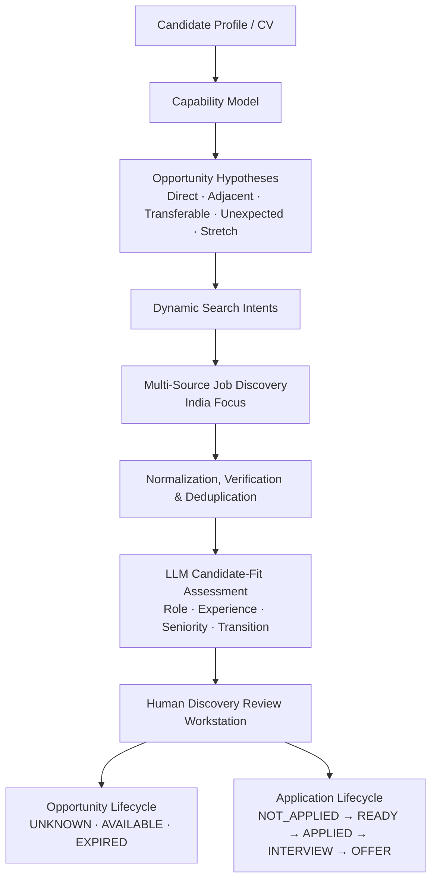

# Career OS

Career OS is an experimental career intelligence and opportunity discovery platform. It explores a candidate-centric model of job search: moving away from traditional keyword queries toward capability-derived opportunity hypotheses, provenance-backed discovery, and human-in-the-loop review.

> **Current Scope Notice**: Career OS is currently in an active validation phase focused exclusively on the **India market**. International discovery and automated application submission are future research tracks.

---

## The Problem & Core Thesis

Traditional job search engines ask:
> *"What jobs contain the keywords I typed into the search box?"*

This keyword-first paradigm produces high noise, misses adjacent or transferable opportunities, and treats every query in isolation.

Career OS is exploring a different question:
> *"What opportunities across the market should this specific candidate know about, given their verified capabilities and career trajectory?"*

### Conceptual Workflow



---

## Current Status & Verification

Career OS is an early-stage experimental system. The current milestone validates discovery quality, candidate-fit scoring, and lifecycle tracking on an India-only opportunity dataset:

- **129 Discovered Opportunities**: Stored in deterministic dataset `india_discovery_results.json`.
- **129 Structured LLM Evaluations**: Pre-computed and mapped in `india_discovery_llm_evaluations.json`.
- **25 / 25 Unit Tests Passing**: Covering adapters, normalizers, geographic verification, router, review server, and lifecycle persistence.
- **Human-in-the-Loop Workstation**: 3-panel review console with real-time composable filtering and lifecycle management.

---

## Key Concepts & Architecture

### 1. Capability-Derived Discovery & Hypotheses
Rather than querying static titles (e.g. *"Product Manager"*), the system derives capability models and categorizes search intents into five hypothesis types:
- **Direct**: Exact target role and domain matches.
- **Adjacent**: Parallel functions leveraging core platform and analytical strengths.
- **Transferable**: Roles where proven skills translate into high-growth alternative domains.
- **Unexpected**: High-upside non-obvious fits surfaced through capability overlap.
- **Stretch**: Ambitious next-level roles with clear upside.

### 2. Informational LLM Candidate-Fit Assessment
The LLM evaluation acts as informational context rather than an opaque gatekeeper. It breaks down candidate alignment across structured dimensions:
- Role Fit & Experience Fit (0–100)
- Transferable Capability & Seniority Fit (0–100)
- Probability of Obtaining ($P(\text{Obtain})$)
- Transition Difficulty & Career Upside
- Key Strengths & Missing Critical Skills

### 3. Separation of Independent Dimensions
Career OS enforces strict boundaries between separate operational concerns:
- **LLM Recommendation**: `STRONG_APPLY` | `APPLY` | `CONSIDER` | `LONG_SHOT` | `SKIP` | `GATE_REJECTED`
- **Human Discovery Verdict**: `RELEVANT` | `ADJACENT` | `WEAK` | `IRRELEVANT`
- **Triage Priority**: `HIGH` | `MEDIUM` | `LOW`
- **Opportunity Status**: `UNKNOWN` | `AVAILABLE` | `EXPIRED`
- **Application Status**: `NOT_APPLIED` | `READY_TO_APPLY` | `APPLIED` | `RECRUITER_CONTACT` | `INTERVIEW` | `REJECTED` | `WITHDRAWN` | `OFFER`

---

## Discovery Review Workstation

Career OS includes a zero-cloud, local review workstation served via a Python standard library HTTP server:

```
┌──────────────────────────┬──────────────────────────────────────┬──────────────────────────┐
│   OPPORTUNITY NAVIGATOR  │        EVIDENCE & JOB VIEW           │   HUMAN DECISION PANEL   │
│                          │                                      │                          │
│ • Filterable job list    │ • Job identity, company, location    │ 1. Discovery Verdict     │
│ • LLM Recommendation     │ • Discovery Provenance & Hypothesis  │ 2. Counterfactual (Y/P/N)│
│ • Overall Score (0-100)  │ • LLM Candidate-Fit Assessment       │ 3. Priority (H/M/L)      │
│ • Review Verdict badge   │ • Strengths & Critical Gaps          │ 4. Opportunity Status    │
│ • Opportunity Status     │ • Full raw job description           │ 5. Application Status    │
│ • Application Status     │ • "View on Source" external link     │ 6. Optional Notes        │
│ • Real-time search       │                                      │ [Save & Next (Enter)]    │
└──────────────────────────┴──────────────────────────────────────┴──────────────────────────┘
```

### Review Server Endpoints
- `GET /discovery` — Discovery Quality Review workstation UI.
- `GET /api/discovery/data` — Loads normalized jobs, LLM evaluations, and human decisions.
- `POST /api/discovery/decide` — Atomically records verdicts, counterfactuals, notes, and lifecycle states.
- `GET /api/discovery/summary` — Aggregate metrics and breakdown across hypothesis types, intents, and sources.

---

## Repository Structure

```text
├── career_os/                  # Core Python modules
│   ├── discovery/              # Discovery pipeline
│   │   ├── candidate_model.py  # Capability extraction
│   │   ├── hypotheses.py       # Hypothesis generation (direct, adjacent, etc.)
│   │   ├── intents.py          # Search query synthesis
│   │   ├── router.py           # Source routing & execution planning
│   │   ├── geography.py        # India geography validation & normalizer
│   │   ├── adapters.py         # Multi-source scraper adapters
│   │   └── normalizer.py       # Deduplication & job schema normalization
│   └── scoring/                # Constraint gates & LLM evaluation engine
├── config/                     # Candidate & source configuration templates
├── review_ui/                  # Lightweight Vanilla HTML/CSS/JS review workstation
│   ├── discovery.html          # Discovery review view
│   ├── discovery.js            # Workstation controller & composable filter engine
│   ├── index.html              # Evaluation review view
│   └── style.css               # Workstation design system
├── tests/                      # Unit test suite (25 tests)
├── review_server.py            # Local review HTTP server
├── discover_india.py           # India discovery pipeline orchestrator
├── evaluate.py                 # LLM evaluation orchestrator
├── scout.py                    # Multi-source scraping coordinator
├── india_discovery_results.json       # Deterministic 129-job discovery dataset
├── india_discovery_llm_evaluations.json # Deterministic 129-job LLM eval dataset
├── discovery_human_review.json        # Local human review & lifecycle persistence
└── .env.example                # LLM provider configuration template
```

---

## Local Setup & Quickstart

### Prerequisites
- Python 3.10+
- Standard browser (Chrome, Edge, Firefox, Safari)

### 1. Configuration
Copy the sample environment file if you plan to execute live LLM evaluations:
```bash
cp .env.example .env
```
Configure your LLM provider and API key in `.env` (Gemini or OpenAI-compatible).

### 2. Run Tests
Verify that all unit tests pass:
```bash
python -m unittest discover tests
```

### 3. Launch Review Workstation
Start the local review server:
```bash
python review_server.py
```
Open your browser and navigate to:
- **Discovery Quality Review**: [http://localhost:8080/discovery](http://localhost:8080/discovery)
- **Evaluation Review**: [http://localhost:8080/](http://localhost:8080/)

### 4. Execute Discovery (Optional / Offline Re-run)
To run the India discovery pipeline against a candidate CV:
```bash
python discover_india.py --cv <path_to_cv.docx>
```

---

## Privacy & Security

Career OS is designed with local-first privacy principles:
- **Candidate CV / Resume**: Personal CV files (`*.docx`, `*.pdf`) are strictly excluded via `.gitignore` and never committed to the repository.
- **Credentials & Keys**: Real API keys, tokens, and `.env` files are gitignored. Only `.env.example` is tracked.
- **Local Persistence**: Human reviews and application status records reside on the local filesystem.

---

## Roadmap

1. **Phase 1 (Current)**: Validate India opportunity discovery quality, LLM fit accuracy, and human-in-the-loop review.
2. **Phase 2**: Analyze review verdicts to calibrate intent generation and transition difficulty models.
3. **Phase 3**: Track multi-stage application lifecycle outcomes to measure real-world shortlisting yield.
4. **Phase 4**: Explore expanded source coverage and international actionable opportunities (e.g. sponsorship/relocation).

---

## License & Usage

Career OS is currently published publicly for visibility and active development. The repository does not currently include an open-source license, and no open-source license rights are granted at this time. All rights reserved.
